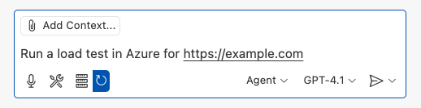
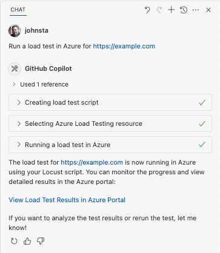

# Azure Load Testing for Visual Studio Code
The Azure Load Testing extension makes it easy to create and run Locust-based load tests using GitHub Copilot—all within VS Code. Iterate locally, then scale effortlessly in Azure. Whether you're new to Locust or a performance testing expert, this extension streamlines test creation, iteration, and scaling in the cloud.

**New! Azure Load Testing now supports GitHub Copilot Agent Mode!**

## Get Started with Agent Mode

### Load Test an Endpoint

Open the **Copilot Chat** window and ensure **Agent Mode** is enabled. 

Then type a prompt like:

`Run a load test in Azure for https://example.com`



Copilot Agent will use multiple MCP tools provided by the Azure Load Testing extension to:
1. Create a Locust test script.
2. Help you select or create an Azure Load Testing resource (you'll be prompted to sign in and pick an Azure subscription).
3. Run the load test in Azure. 
    - A `load.config.yaml` file is created for easy reuse.
    - If your app is hosted in Azure, you'll be prompted to enable optional server-side metrics for deeper test insights.

Once the load test starts, you can view detailed results and live metrics in the Azure portal.




### Fetch Insights and Implement Suggestions with Copilot

Azure Load Testing now generates **AI-driven insights** for each test run. These insights and recommendations can be retrieved directly in VS Code. 

After your test completes, try prompting Copilot:

`Fetch insights from my Azure load test run`

Copilot will summarize key findings and may suggest optimizations. You can then ask Copilot to help implement any recommended changes. 

**Tip:** To retrieve insights from a previous run, prompt: 

`Fetch insights from another test run`

VS Code will display a list of past test runs to choose from. 

### Create Realistic Load Tests from HTTP files or API Collections

The extension supports generating Locust test scripts from a variety of inputs—including HTTP files, Postman collections, and Insomnia collections. This enables Copilot to build rich test scenarios with real API calls, request data, and auth details.
    
#### From an HTTP file
If you have a file named `myrequests.http` in your VS Code workspace, try: 

`Create a load test script based on the http file myrequests.http`

#### From a Postman Collection
For a file like `myapi.postman_collection.json`:

`Create a load test script based on the Postman collection myapi.postman_collection.json`

#### From an Insomnia Collection
For a file like `myapi.insomnia_collection.json`:

`Create a load test script based on the Insomnia collection myapi.insomnia_collection.json`

#### From a URL
Don't have any files? You can still start with a simple input:

`Create a load test script for the endpoint https://example.com`


## Get Started with Ask Mode
This tutorial guides you through generating, refining, and executing realistic load tests. 

By the end, you'll have a fully functional load test script generated from a **Postman collection**, **Insomnia collection**, or **.http file**, enhanced with Copilot-powered improvements, and ready to scale in **Azure Load Testing**.


### Prerequisites

Before you begin, make sure you have the following:  

1. **Azure Load Testing extension for VS Code** – [Download and install it here](https://aka.ms/malt-vscode/get).  
2. **GitHub Copilot** – [Set up Copilot in VS Code](https://code.visualstudio.com/docs/copilot/setup) to generate and refine test scripts. *Tip: If you don’t have a subscription, you can activate a free trial.* 
3. **Python & Locust** – Required to run and validate your **Locust** test scripts locally from VS Code. [Install Locust here](https://docs.locust.io/en/stable/installation.html).
4. **An Azure account** – Needed to run load tests at scale in **Azure Load Testing**. If you don’t have an account, [sign up for free](https://azure.microsoft.com/free/).

**Tip:** VS Code's GitHub Copilot Chat offers multiple AI models. You can switch models using the model picker in the chat input field. If you're unsure which one to use, we recommend GPT-4o.

### Open the Walkthrough  

To get started, open the command palette in VS Code and run: **Load Testing: Open Walkthrough**. This walkthrough provides the key entry points of the extension. 

You can also access the features directly from the command palette by using the **Load Testing** prefix. Some commonly used commands include:  
- **Load Testing: Create Locust test**  
- **Load Testing: Run load test (local)**  
- **Load Testing: Run load test (Azure Load Testing)** 


### Generate a Locust Script with Copilot

You can generate a Locust script from any existing Postman collection, Insomnia collection, or .http file. If the file contains multiple requests, Copilot will attempt to sequence them into a cohesive scenario. 

1. Click the **Create a Load Test** button in the walkthrough, or run **Load Testing: Create Locust test** from the command palette.

1. You can choose the source to auto-generate a Locust test script:
    - Selecting a **Postman collection**, **Insomnia collection**, or **.http file** lets Copilot extract multiple API operations, request data, and authentication details—creating a more complete and realistic load test.
    - Choosing **Single URL** allows you to enter a single endpoint URL, generating a simple script you can customize or expand.

1. **For this walkthrough**, you can select **Try Sample: Pet Shop API**, which uses the [**`petstore-sample.http`**](https://aka.ms/malt-vscode/http-sample) file to generate a sample Locust test script. 

1. Copilot will analyze the selected file and generate a **Locust-based load test script**, automatically:
    - Sequencing API requests to simulate real-world usage.  
    - Handling authentication securely. 

1. Once the script is generated, the **Copilot Chat** window will suggest additional setup steps, such as defining **environment variables**.  
    - If Copilot suggests environment variables, create a `.env` file in your project and add the recommended values.  

### Customize the Load Test Script
Before running the test, you can refine it with Copilot. For example, by examining the script, you might notice that the same request payload is sent with every request:  

```python
payload = {
    "id": self.pet_id,
    "name": "Fluffy",
    "category": {"id": 1, "name": "Dogs"},
    "photoUrls": ["https://example.com/photo.jpg"],
    "tags": [{"id": 1, "name": "cute"}],
    "status": "available"
}
```

To make the test more dynamic by randomizing the request payload:

1. Open the **Copilot Chat** panel.
2. Type: `Randomize request payloads` and press Enter.
3. Copilot will generate a suggested modification to introduce randomization.
4. Click **Apply in Editor** that appears above the generated code snippet in Copilot Chat window.
5. After reviewing the changes, click **Keep** to accept and update your script.
6. Save the file

Now, each request simulates a more realistic user interaction. The code will look something like the following:
```python
payload = {
    "id": self.pet_id,
    "name": f"Pet{random.randint(1, 1000)}",
    "category": {"id": random.randint(1, 10), "name": random.choice(["Dogs", "Cats", "Birds"])},
    "photoUrls": [f"https://example.com/photo{random.randint(1, 100)}.jpg"],
    "tags": [{"id": random.randint(1, 10), "name": random.choice(["cute", "friendly", "playful"])}],
    "status": random.choice(["available", "pending", "sold"])
}
```

### Run the Load Test

You can execute your load test in two ways:
- [Run locally](#run-locally-for-quick-validation) for quick validation
- [Run in Azure Load Testing](#scale-up-in-azure-load-testing) for high-scale, multi-region load

### Run Locally for Quick Validation
To quickly validate your test, run it locally using Locust from **Visual Studio Code**:
1. Open the command palette and run: **Load Testing: Run load test (local)**. 
1. This will automatically launch the **Locust web UI** in a browser. It can take a few seconds for the Locust server to be ready and for the browser to open. 
1. In the **Start new load test** page, review the input fields and click **Start**. Locust will begin sending requests, logging any failures, and tracking performance statistics.


1. Explore the **Locust UI** to analyze response times, error rates, and request throughput.


**Tip:** If Locust reports failures for the `Retrieve Pet` and `Update Pet` requests, it may be due to how the Pet Store API processes requests. Try asking Copilot to "**Add random delays between requests in run_scenario**". If you suspect an issue with the script itself, set `DEBUG_MODE=True` as an environment variable and rerun the test to get more detailed debug information.

If you prefer running the test from a **VS Code Terminal**:  
1. Open a terminal in VS Code.  
2. Run the following command:  
    ```sh
    locust -f path/to/locustfile.py -u 10 -r 2 --run-time 1m
    ```
    * `-f path/to/locustfile.py` → Specifies the Locust test script.
    * `-u 10` → Simulates up to 10 virtual users.
    * `-r 2` → Ramps up 2 virtual users per second.
    * `--run-time 1m` → Runs the test for 1 minute.
3. Open a browser to `http://0.0.0.0:8089` to view the Locust web UI.

### Scale Up in Azure Load Testing
For high-load scenarios where you need to simulate many thousands of concurrent virtual users across multiple regions, you can run your test in **Azure Load Testing**.  

To execute a large-scale test:  

1. Open the **command palette** and run: **Load Testing: Run load test (Azure Load Testing)**.
1. Select **Create a configuration file...**. 
1. Follow the guided setup, which includes:
    - Signing into Azure and selecting your subscription.
    - Creating a new Azure Load Testing resource or selecting an existing one.
    - Choosing load test regions to distribute traffic globally.
1. Once the setup is complete, a YAML configuration file (e.g., `loadtest.config.yaml`) is generated and added to your workspace root folder.  
    - This file defines the Locust script, load parameters, environment variables, regions, and any additional files (e.g., CSV datasets).  
    - Defaults are 200 virtual users running for 120 seconds in each selected region.
    - Commit this file in your repository to reuse and automate future load test executions.  
1. Copilot validates the configuration before execution. Follow any instructions provided in the chat window. Otherwise, if everything checks out, the test script and its related artifacts are uploaded to Azure Load Testing and prepared for execution. *(This process may take up to a minute—progress is shown in the **Output** panel.)*  

1. When the test starts, a notification (toast message) appears in the bottom-right corner. Click the **Open in Azure Portal** button to monitor test execution in real time.  

Tip: To quickly access test results from previous runs, use the command: **Load Testing: View load test runs**.


## Next Steps
So far in this quickstart, sensitive variables like `API_KEY` were stored in a `.env` file and uploaded to the cloud service. However, as a best practice, secrets should be securely managed in **Azure Key Vault**. The extension provides guidance on setting this up.

### Secure Secrets with Azure Key Vault
1. Open the **Copilot Chat** window, type `@testing /setupLoadTestSecretsInAzure` and hit Enter.
1. Copilot will guide you through:
    - Creating an Azure Key Vault.
    - Assigning a managed identity to your Azure Load Testing resource.
    - Adding secrets to Azure Key Vault.
    - Configuring your YAML file to reference Key Vault secrets instead of `.env`.

Whenever you modify your Locust script or YAML configuration, you can re-run the test by executing **Run load test (Azure Load Testing)**.

For more information, visit the [Azure Load Testing documentation](https://learn.microsoft.com/azure/load-testing/).

## Privacy and preview terms
By using the Azure Load Testing extension for VS Code, you agree to the [Microsoft Azure Load Testing Extension for Visual Studio Code Preview terms](https://aka.ms/malt-vscode/license). Review the [transparency note](https://aka.ms/malt-vscode/transparency) to understand about usage, limitations, and ways to improve Copilot Chat during the technical preview.

Your code is yours. We follow responsible practices in accordance with our [Privacy Statement](https://docs.github.com/en/site-policy/privacy-policies/github-general-privacy-statement) to ensure that your code snippets will not be used as suggested code for other users of GitHub Copilot.

To get up-to-date security fixes, use the latest version of the Copilot extension and Visual Studio Code.

## Telemetry
Visual Studio Code collects usage data and sends it to Microsoft to help improve our products and services. Read the [Microsoft Privacy Statement](https://www.microsoft.com/privacy/privacystatement) to learn more. If you don't want to send usage data to Microsoft, you can set the telemetry.enableTelemetry setting to false. Get more information in the [FAQ section](https://code.visualstudio.com/docs/supporting/faq#_how-to-disable-telemetry-reporting).
